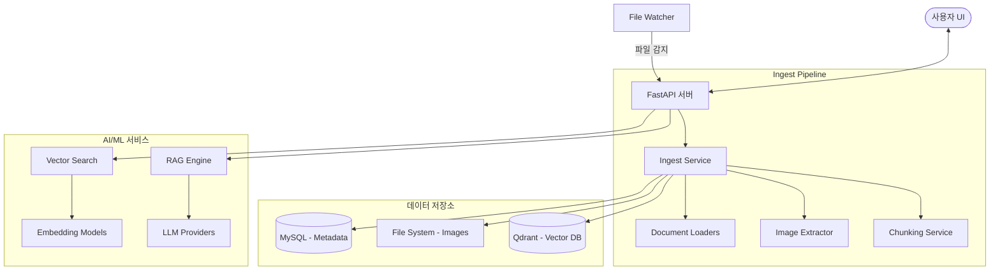
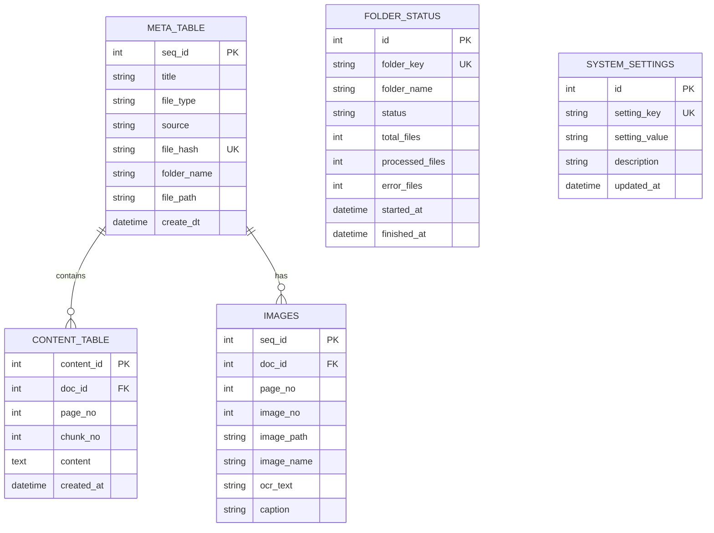

# DataWave - Technical Requirements Document (TRD)

## 1. 시스템 개요
DataWave는 기업 내 다양한 형식의 문서를 자동으로 수집, 분석하여 벡터 데이터베이스에 적재하고, 이를 기반으로 시맨틱 검색 및 RAG(Retrieval-Augmented Generation) 기능을 제공하는 시스템입니다.

### 1.1 시스템 아키텍처


### 1.2 컴포넌트 구성
- **FastAPI Server**: RESTful API 엔드포인트 및 웹 UI 서빙
- **File Watcher**: `watchdog` 라이브러리를 사용한 특정 디렉토리(`watch_dir/incoming`) 감시 및 자동 인제스트 트리거
- **Ingest Service**: 파일 해시 계산, 메타데이터 추출, 이미지 분리, 텍스트 추출, 청킹, 임베딩 및 저장 프로세스 제어
- **Document Loaders**: PDF, DOCX, XLSX, CSV, TXT 등 다양한 포맷별 텍스트 추출 엔진
- **Vector DB (Qdrant)**: 고성능 벡터 유사도 검색 엔진
- **RAG Engine**: 검색된 컨텍스트를 LLM(OpenAI, Gemini, Ollama)에 전달하여 답변 생성

## 2. 기술 스택 상세
### 2.1 백엔드
- **Language**: Python 3.10+
- **Framework**: FastAPI
- **ORM**: SQLAlchemy (with PyMySQL)
- **Task Scheduling**: Watchdog (실시간 감시), Batch Processor (폴더 단위 처리)

### 2.2 데이터베이스
- **MySQL 8.0+**: 문서 메타데이터, 텍스트 청크(백업/검색용), 이미지 메타데이터, 처리 상태 관리

### 2.3 벡터 DB
- **Qdrant**: 벡터 유사도 검색 및 페이로드 필터링 (Folder, File Type 등)

### 2.4 AI/ML
- **Embedding Models**:
    - OpenAI: `text-embedding-3-large` (3072 dim)
    - Ollama: `nomic-embed-text` (768 dim), `bge-m3` (1024 dim), `gemma2_embed` (768 dim)
    - Gemini: `models/embedding-001` (768 dim)
- **LLM Providers**:
    - OpenAI (GPT-4o mini)
    - Google Gemini (Gemini 1.5 Flash)
    - Ollama (Local Llama 3.2 등)
- **OCR/Vision**:
    - Tesseract OCR (이미지 텍스트 추출)
    - PyMuPDF (PDF 내 이미지 추출)

### 2.5 프론트엔드
- **Technologies**: Vanilla JS, HTML5, CSS3, TailwindCSS (optional/standard CSS)
- **Structure**: Iframe 기반의 모듈형 대시보드 구조
- **UI 메뉴**:
    - 대시보드 (통계, 파이프라인 제어, 시스템 상태, 로그)
    - 업로드 (파일/폴더 업로드)
    - 검색 (벡터 유사도 검색)
    - RAG 채팅 (질의응답)
    - 문서 관리 (meta_table 조회/삭제)
    - 환경설정 (LLM 모델 선택)

## 3. API 상세 명세
### 3.1 문서 관리 API (`/documents`)
- `GET /documents`: 문서 목록 조회 (필터: folder_name, file_type)
- `GET /documents/{doc_id}`: 단일 문서 상세 정보 및 청크/이미지 통계 조회
- `DELETE /documents/{doc_id}`: 문서 및 관련 데이터(DB, Vector, Files) 영구 삭제
- `POST /documents/batch-delete`: 여러 문서 일괄 삭제
- `DELETE /documents/folder/{folder_name}`: 특정 폴더 내 모든 문서 삭제

### 3.2 검색 API (`/search`)
- `POST /search`: 벡터 유사도 검색
    - Request: `{ "query": str, "top_k": int, "folder_name": str, "score_threshold": float }`
    - Response: 검색된 청크 목록 및 메타데이터, 유사도 점수
- `GET /search/collections`: 사용 가능한 Qdrant 컬렉션 목록
- `GET /search/collection/{name}/info`: 컬렉션 상세 정보 (벡터 수, 차원 등)

### 3.3 RAG API (`/rag`)
- `POST /rag/chat`: RAG 기반 질의응답
    - Request: `{ "question": str, "llm_provider": str, "llm_model": str, "top_k": int }`
    - Response: `{ "answer": str, "sources": list, "llm_provider": str }`
- `GET /rag/config`: 현재 설정된 임베딩 및 LLM 기본값 조회

### 3.4 대시보드 API (`/api/dashboard`)
- `GET /api/dashboard/summary`: 전체 통계 (총 문서, 성공, 중복, 에러)
- `GET /api/dashboard/status`: 시스템 상태 (DB, Vector DB 연결 여부 및 모델 정보)
- `GET /api/dashboard/detail`: 요약 + 최근 처리 문서 리스트
- `GET /api/dashboard/folders`: 최근 처리된 폴더별 상태 목록

### 3.5 파이프라인 API (`/pipeline`)
- `GET /pipeline/status`: 워처 파이프라인 실행 상태 및 업타임
- `POST /pipeline/start`: 파이프라인 시작
- `POST /pipeline/stop`: 파이프라인 중지
- `POST /pipeline/restart`: 파이프라인 재시작

### 3.6 파일 업로드 API (`/files`)
- `POST /files/upload`: 개별 파일 업로드 (incoming 폴더로 저장)
- `POST /files/upload-folder-raw`: 폴더 구조를 유지한 다중 파일 업로드
- `GET /files/status/{tracking_id}`: 파일 처리 상태 추적

### 3.7 설정 API (`/settings`)
- `GET /settings`: 전체 설정 조회 (LLM, Embedding)
- `GET /settings/llm`: LLM 설정만 조회
- `PUT /settings/llm`: LLM 설정 변경
    - Request: `{ "provider": str, "model": str }`
    - Response: `{ "success": bool, "current": {...} }`
- `GET /settings/embedding`: Embedding 설정 조회
- `PUT /settings/embedding`: Embedding 모델 변경
    - Request: `{ "model_key": str }`
    - Response: `{ "success": bool, "requires_reindex": bool, "warning": str }`
    - ⚠️ 모델 변경 시 재인덱싱 필요
- `POST /settings/embedding/reindex`: Embedding 재인덱싱 실행
    - Query Params: `doc_id` (선택, 특정 문서만 재인덱싱)
    - Response: `{ "success": bool, "total_chunks": int, "success_chunks": int }`
- `GET /settings/verify`: 설정 동기화 상태 검증
- `POST /settings/reset`: 환경변수(.env) 기본값으로 초기화

#### 사용 가능한 Embedding 모델
| Model Key | 모델명 | 차원 | 엔진 |
|-----------|--------|:----:|------|
| `openai_large` | text-embedding-3-large | 3072 | OpenAI |
| `nomic` | nomic-embed-text | 768 | Ollama |
| `bge_m3` | bge-m3 | 1024 | Ollama |
| `gemini_embed` | embedding-001 | 768 | Gemini |
| `gemma2_embed` | gemma2 embedding | 768 | Ollama |

## 4. 데이터베이스 설계
### 4.1 ERD 요약


### 4.2 테이블 상세
#### `meta_table`
| 컬럼명 | 타입 | 제약조건 | 설명 |
| :--- | :--- | :--- | :--- |
| seq_id | INT | PK, AI | 문서 고유 ID |
| title | VARCHAR(255) | | 파일명 또는 제목 |
| file_type | VARCHAR(20) | | 확장자 (pdf, docx 등) |
| source | VARCHAR(50) | | 유입 경로 (watcher, upload 등) |
| file_hash | VARCHAR(40) | UNIQUE | SHA1 파일 해시 (중복 방지) |
| folder_name | VARCHAR(255) | | 소속 폴더명 |
| file_path | VARCHAR(500) | | 실제 파일 저장 경로 |
| create_dt | DATETIME | DEFAULT NOW | 등록 일시 |

#### `content_table`
| 컬럼명 | 타입 | 제약조건 | 설명 |
| :--- | :--- | :--- | :--- |
| content_id | INT | PK, AI | 청크 고유 ID (Qdrant Point ID로 사용) |
| doc_id | INT | FK(meta_table) | 문서 ID |
| page_no | INT | | 페이지 번호 |
| chunk_no | INT | | 페이지 내 청크 순번 |
| content | TEXT | | 청킹된 텍스트 내용 |

#### `system_settings`
| 컬럼명 | 타입 | 제약조건 | 설명 |
| :--- | :--- | :--- | :--- |
| id | INT | PK, AI | 설정 고유 ID |
| setting_key | VARCHAR(100) | UNIQUE | 설정 키 (llm_provider, llm_model 등) |
| setting_value | VARCHAR(500) | NOT NULL | 설정 값 |
| description | VARCHAR(255) | | 설정 설명 |
| updated_at | DATETIME | ON UPDATE | 마지막 수정 일시 |

## 5. 벡터 DB 설계
### 5.1 컬렉션 구조
- **Naming Rule**: `{BASE_COLLECTION}_{MODEL_KEY}_v{VERSION}`
    - 예: `documents_openai_large_v2`
- **Distance**: Cosine Similarity (대부분의 임베딩 모델 표준)

### 5.2 페이로드 스키마
Qdrant에 저장되는 Payload 데이터 구조:
```json
{
  "content": "텍스트 내용 (최대 1500자 내외)",
  "metadata": {
    "content_id": 123,
    "doc_id": 45,
    "page_no": 1,
    "chunk_no": 1,
    "folder_name": "2024_reports",
    "title": "sample.pdf",
    "file_type": "pdf",
    "source": "watcher"
  }
}
```

## 6. 파일 처리 파이프라인
### 6.1 처리 흐름도
1.  **감지**: Watcher가 `incoming/` 내 신규 파일/폴더 감지
2.  **이동**: 파일을 `processing/` 폴더로 이동하여 작업 안정성 확보
3.  **검증**: SHA1 해시 계산 후 `meta_table` 중복 체크
    - 중복 시 `duplicated/`로 이동 후 종료
4.  **이미지 추출**: 문서 내 이미지 추출 및 `images/{doc_id}/` 경로 저장
5.  **텍스트 로딩**: 파일 타입별 Loader를 통한 텍스트 추출
6.  **청킹**: 설정된 사이즈(기본 500자, 오버랩 100자)로 텍스트 분할
7.  **벡터화**: 선택된 임베딩 모델을 통한 벡터 생성 및 Qdrant 적재
8.  **완료**: 파일을 `processed/` 폴더로 이동 및 DB 트랜잭션 커밋
9.  **에러**: 실패 시 `error/` 폴더로 이동 및 로그 기록

### 6.2 로더별 상세
- **PDF**: `PyMuPDF (fitz)` 라이브러리를 사용하며, 페이지 단위로 텍스트를 추출하고 `replace("\xa0", " ")`를 통해 텍스트를 정규화합니다.
- **DOCX**: `python-docx`를 사용하여 문서 내 텍스트를 문단 단위로 추출합니다.
- **Excel/CSV**: `pandas`와 `openpyxl`, `xlrd`를 사용하여 시트/행 단위로 데이터를 읽어 텍스트화합니다.
- **TXT**: 표준 Python 파일 I/O를 사용하여 전체 텍스트를 로드합니다.
- **Images**: `pytesseract` OCR 엔진을 사용하여 이미지 내 텍스트를 추출합니다 (한국어/영어 지원).

### 6.3 이미지 추출 로직
`services/images/image_extractor.py`에서 파일 형식별로 차별화된 추출 방식을 사용합니다.
- **PDF**: `PyMuPDF`의 `get_images`와 `extract_image`를 사용하여 페이지별 이미지를 고유 xref 기반으로 추출합니다.
- **OOXML (DOCX, XLSX, PPTX)**: 파일이 ZIP 구조임을 활용하여 `word/media/`, `xl/media/` 등의 내부 경로에서 이미지를 직접 추출합니다.
- **이미지 파일**: 원본 이미지를 그대로 문서별 이미지 디렉토리에 복사하여 보관합니다.

### 6.4 Chunking 전략
- **방식**: 고정 크기 슬라이딩 윈도우 (Fixed-size Sliding Window)
- **Size**: 500 characters
- **Overlap**: 100 characters
- **안전장치**: 
    - `max_chunks=200`: 단일 문서당 최대 청크 수를 제한하여 리소스 과부하 및 무한 루프 방지
    - `normalize_for_embedding`: 불필요한 공백 제거 및 텍스트 정규화 수행

## 7. 디렉토리 구조
```text
AI_WORKPLACE_CRAWLER/
├─ app/                     # FastAPI 애플리케이션
│  ├─ api/                  # API 엔드포인트 라우터
│  └─ lifespan.py           # 앱 시작/종료 이벤트
├─ batch/                   # 폴더 단위 배치 처리 로직
├─ config/                  # DB, 환경설정, 경로 설정
├─ docs/                    # PRD, TRD 등 문서
├─ images/                  # 추출된 이미지 저장소 (doc_id별)
├─ models/                  # SQLAlchemy ORM 모델
├─ pipeline/                # 파이프라인 상태 및 실행 제어
├─ services/                # 핵심 비즈니스 로직
│  ├─ loaders/              # 파일 타입별 로더
│  ├─ images/               # 이미지 추출 모듈
│  └─ utils/                # 해시, 파일 조작 유틸
├─ static/                  # 프론트엔드 정적 파일 (JS, CSS)
├─ templates/               # HTML 템플릿
├─ vector/                  # 벡터 DB 및 임베딩 로직
├─ watch_dir/               # 워처 대상 디렉토리 (incoming, processed 등)
├─ main.py                  # API 서버 실행 진입점
└─ .env                     # 환경 변수 설정
```

## 8. 환경 설정
### 8.1 필수 환경변수
- `DB_HOST`, `DB_PORT`, `DB_NAME`, `DB_USER`, `DB_PASSWORD`: MySQL 연결 정보
- `QDRANT_HOST`, `QDRANT_PORT`: Qdrant 서버 정보
- `MODEL_KEY`: 사용할 임베딩 모델 키 (예: `openai_large`, `nomic`)
- `OPENAI_API_KEY`: OpenAI API 사용 시 필수
- `GOOGLE_API_KEY`: Gemini API 사용 시 필수

### 8.2 선택 환경변수
- `LLM_PROVIDER`: 기본 LLM 제공자 (default: `openai`)
- `LLM_MODEL`: 기본 LLM 모델명 (default: `gpt-4o-mini`)
- `BASE_COLLECTION`: 벡터 컬렉션 접두어 (default: `documents`)

### 8.3 런타임 설정 저장
- **저장 위치**: MySQL `system_settings` 테이블
- **우선순위**: DB 저장값 > 환경변수(.env) > 기본값
- **동작 방식**:
    - 서버 시작 시 DB에서 설정 로드
    - UI에서 설정 변경 시 메모리 + DB 동시 저장
    - 서버 재시작 후에도 설정 유지

### 8.4 런타임 설정 적용 범위
Settings UI에서 변경한 LLM 설정은 다음 컴포넌트에서 실시간으로 적용됩니다:

| 컴포넌트 | 적용 여부 | 설명 |
|---------|:-------:|------|
| RAG Chat API (`/rag/chat`) | O | 질의응답 시 LLM provider/model 사용 |
| Settings API (`/settings/*`) | O | 설정 조회/변경/검증 |
| 메모리 (RuntimeSettings) | O | 싱글톤 인스턴스로 전역 적용 |
| Database (system_settings) | O | 영구 저장 및 서버 재시작 후 복원 |

#### 설정 적용 검증 API
`GET /settings/verify` 엔드포인트를 통해 설정이 시스템 전체에 올바르게 적용되었는지 확인할 수 있습니다.

```json
// Response 예시
{
  "runtime": { "provider": "openai", "model": "gpt-4o-mini" },
  "database": { "provider": "openai", "model": "gpt-4o-mini", "synced": true },
  "rag_api": { "provider": "openai", "model": "gpt-4o-mini" },
  "all_synced": true,
  "message": "All settings are synchronized"
}
```

#### 설정 흐름도
```
Settings UI 변경
      ↓
PUT /settings/llm 호출
      ↓
┌─────────────────────────────────┐
│  RuntimeSettings.set_llm()      │
│  ├─ 메모리 업데이트 (즉시 적용)  │
│  └─ DB 저장 (영구 보존)         │
└─────────────────────────────────┘
      ↓
RAG Chat에서 runtime_settings.llm.provider/model 참조
      ↓
선택된 LLM으로 답변 생성
```

### 8.5 Embedding 모델 변경 시 주의사항

Embedding 모델 변경은 벡터 차원이 다르므로 **재인덱싱이 필수**입니다.

#### 변경 시 발생하는 일
1. 새로운 Qdrant 컬렉션 생성 (예: `documents_nomic_v2`)
2. 기존 컬렉션의 데이터는 그대로 유지 (검색 불가)
3. 환경변수 `MODEL_KEY`가 런타임에서 업데이트됨

#### 재인덱싱 방법
```bash
# CLI에서 실행
python scripts/rebuild_vector_from_db.py --model-key nomic

# 또는 API 호출
POST /settings/embedding/reindex
```

#### Embedding 변경 흐름도
```
Settings UI에서 Embedding 모델 선택
      ↓
PUT /settings/embedding 호출
      ↓
┌─────────────────────────────────┐
│  RuntimeSettings.set_embedding()│
│  ├─ 메모리 업데이트             │
│  ├─ DB 저장                     │
│  └─ 환경변수 MODEL_KEY 업데이트 │
└─────────────────────────────────┘
      ↓
⚠️ 경고: 재인덱싱 필요
      ↓
POST /settings/embedding/reindex 호출
      ↓
┌─────────────────────────────────┐
│  rebuild_vectors_async()        │
│  ├─ 새 컬렉션 생성/확인         │
│  ├─ content_table 조회          │
│  ├─ 새 모델로 임베딩 생성       │
│  └─ Qdrant에 upsert             │
└─────────────────────────────────┘
      ↓
새 모델로 검색 가능
```

## 9. 배포 가이드
### 9.1 사전 요구사항
- Python 3.10+
- MySQL 8.0 서버
- Qdrant 서버 (Docker 권장)
- Tesseract OCR 엔진 설치 (이미지 처리 필요 시)

### 9.2 설치 단계
1.  저장소 클론
2.  가상환경 생성 및 활성화: `python -m venv venv`
3.  의존성 설치: `pip install -r requirements.txt`
4.  `.env` 파일 설정 (8.1 참조)

### 9.3 실행 방법
- **API 서버 실행**: `uvicorn app.main:app --host 0.0.0.0 --port 8000 --reload`
- **워처 파이프라인**: API 서버 실행 시 `lifespan` 이벤트를 통해 자동 시작되거나, `/pipeline/start` API 호출을 통해 실행

## 10. 의존성 목록
- `fastapi`, `uvicorn`: 웹 서버 프레임워크
- `sqlalchemy`, `pymysql`: DB 연동
- `qdrant-client`: 벡터 DB 연동
- `openai`, `google-generativeai`, `ollama`: AI 모델 연동
- `pymupdf`, `python-docx`, `pandas`: 문서 파싱
- `pytesseract`, `pillow`: 이미지 처리
- `watchdog`: 파일 시스템 감시
- `python-dotenv`: 환경 변수 로드
